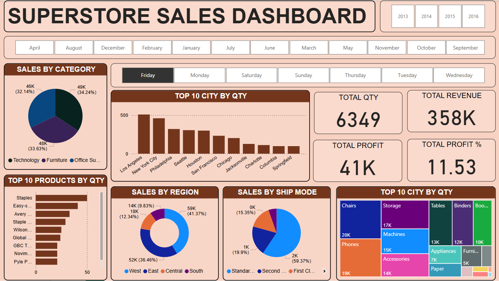

# 📊 Superstore Sales Dashboard

## 📌 Overview
The **Superstore Sales Dashboard** is an interactive data visualization built in **Power BI** that provides insights into sales performance across multiple dimensions — including **category**, **city**, **region**, **shipping mode**, and **top products**.  
It helps track **total quantity sold**, **revenue**, **profit**, and **profit percentage** for different time frames.

---

## 🚀 Features
- **Sales by Category**: Breaks down sales into Technology, Furniture, and Office Supplies.
- **Top Cities by Quantity**: Highlights the top 10 performing cities.
- **Top Products by Quantity**: Displays the best-selling products.
- **Sales by Region**: Shows regional sales distribution.
- **Sales by Ship Mode**: Analyzes orders based on shipping preferences.
- **Key Metrics**: Quick stats for total quantity, revenue, profit, and profit %.
- **Interactive Filters**: Allows filtering by year, month, and weekday.

---

## 🛠️ Tools & Technologies
- **Visualization Tool**: Power BI
- **Dataset**: Imported from a CSV file containing sales data
- **Charts Used**: Pie charts, bar charts, treemap, KPIs

---

## 📊 Key Insights
- **Highest sales category**: Technology
- **Top city by sales quantity**: Los Angeles
- **Most sold product**: Staples
- **Region with highest sales**: East
- **Preferred shipping mode**: Standard Class

---

## 📜 License
This project is licensed under the **MIT License**

---

## 📧 Contact
Created by **Ajay Kumar**  
📩 Email: **ajaykmr7150@gmail.com**

---

⭐ If you like this project, don’t forget to star the repo!

